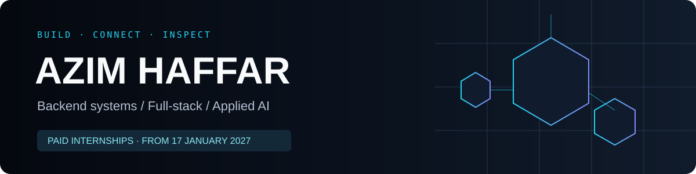

**Software Engineering student · Former Backend Intern at Trendyol**

[Portfolio](https://azimx.dev) · [LinkedIn](https://www.linkedin.com/in/azim-haffar/) · [Email](mailto:azim.haffar@gmail.com)

Paid internships from **17 January 2027** · 4–12 months preferred · Open to relocation

## Three systems. Three engineering questions.

| Project | The question | Explore |
| --- | --- | --- |
| **[OrderFlow](https://github.com/azim-haffar/OrderFlow)** | What happens when an order event arrives twice? | Java / Spring Boot · transactional outbox · Kafka · PostgreSQL locks · Testcontainers |
| **[HireLens](https://github.com/azim-haffar/HireLens)** | Can a CV-to-job score explain its reasoning? | Python / FastAPI · React · Supabase · LLM extraction + rule-based scoring · [Live frontend](https://hirelens-alpha.vercel.app) |
| **[ML Training Inspector](https://github.com/azim-haffar/ml-training-inspector)** | What is the model doing while it learns? | PyTorch · WebSockets · gradient monitoring · [Video walkthrough](https://youtu.be/x7-KYXCESMw) |

## Experience beyond personal projects

**Trendyol · Backend Engineering Intern** — June–September 2025 
Built and demonstrated a Spring Boot/PostgreSQL Coupon Usage Tracker, wrote unit and integration tests, packaged it with Docker, and contributed API changes and bug fixes within existing services.

**Kvote 2 Hjælperen · Freelance Software Developer** — February–April 2026 
Delivered a paid Python/LLM study-question tool with a separate LLM evaluation step and application-level validation.

<b>Education, languages & toolkit</b>

B.Sc. Software Engineering, **OSTİM Technical University** · English-taught · Expected graduation **August 2027**. 
**42 Prague Piscine** · September–October 2025.

English C1 · German B1, Goethe-certified · Native Turkish and Arabic. Based in Mersin, Türkiye.

Java · Spring Boot · Python · FastAPI · React · TypeScript · PostgreSQL · Kafka · Redis · Docker · JUnit · Mockito · Testcontainers · GitHub Actions.

---

**Have something worth building?** [See the work and get in touch →](https://azimx.dev)
