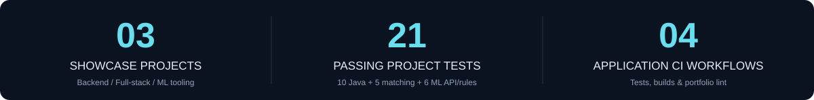
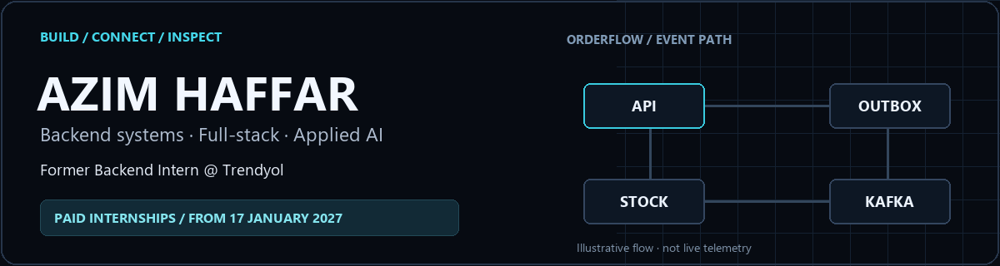

**Software Engineering student · Former Backend Intern at Trendyol**

**Paid internships from 17 January 2027** · 4–12 months preferred · Open to relocation

Verified snapshot: 3 October 2026. Test counts describe covered cases, not model accuracy or production readiness.

## Pick an engineering question

| Project | What makes it worth opening | Evidence & demo |
| :--- | :--- | :--- |
| **[OrderFlow →](https://github.com/azim-haffar/OrderFlow)** `Java` `Spring Boot` `Kafka` | **An event arrives twice. Stock moves once.** Transactional outbox, coordinated order/product locks, Redis caching. | **10 passing Java tests**, including concurrent duplicate delivery. [Architecture](https://github.com/azim-haffar/OrderFlow/blob/main/docs/architecture.md) · [Case study](https://azimx.dev/projects/orderflow) |
| **[HireLens →](https://github.com/azim-haffar/HireLens)** `Python` `FastAPI` `React` | **A match score you can trace.** LLM extraction, rule-based scoring, Supabase-backed workflows. | **5 matching/advice regression tests.** [Live frontend](https://hirelens-alpha.vercel.app) · [Scoring code](https://github.com/azim-haffar/HireLens/blob/main/backend/app/services/match_scorer.py) |
| **[ML Training Inspector →](https://github.com/azim-haffar/ml-training-inspector)** `PyTorch` `WebSockets` `React` | **Watch the learning, not the loading bar.** Loss, class accuracy, gradient norms, threshold alerts and manual stop. | **6 API/configuration/anomaly tests**; no model-quality benchmark claimed. [Video walkthrough ▶](https://youtu.be/x7-KYXCESMw) · [Training loop](https://github.com/azim-haffar/ml-training-inspector/blob/main/backend/trainer.py) |

**OrderFlow** 
**HireLens** 
**ML Inspector** 
**Portfolio** 

## Built beyond the classroom

| Where | What I delivered |
| :--- | :--- |
| **Trendyol · Backend Intern** Jun–Sep 2025 | Spring Boot/PostgreSQL Coupon Usage Tracker, unit/integration tests and Docker packaging; API changes and bug fixes in existing services. |
| **Kvote 2 Hjælperen · Paid freelance development** Feb–Apr 2026 | Python/LLM study-question tool with a separate LLM evaluation step and application-level validation. |

<b>Education, languages & toolkit</b>

B.Sc. Software Engineering, **OSTİM Technical University** · English-taught · Expected graduation **August 2027**. 
**42 Prague Piscine** · September–October 2025.

English C1 · German B1, Goethe-certified · Native Turkish and Arabic. Based in Mersin, Türkiye.

Java · Spring Boot · Python · FastAPI · React · TypeScript · PostgreSQL · Kafka · Redis · Docker · JUnit · Mockito · Testcontainers · GitHub Actions.

<b>Prefer a static banner?</b>

The animation stops after three loops. Its moving event is an illustration, not a live system measurement.

---

**Have something worth building?** [Explore the portfolio and get in touch →](https://azimx.dev)
